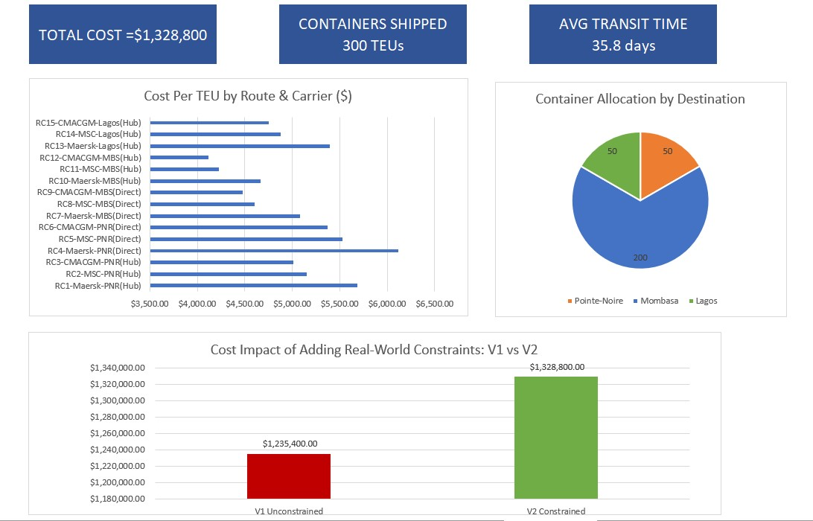

# 🚢 Freight Cost Optimization : Shanghai to Africa
### Excel-Based Supply Chain Analytics Project
 
**Tools:** Excel (Solver, VLOOKUP, SUMPRODUCT, Dashboard)  
**Domain:** Supply Chain | Freight Analytics | Route Optimization  
**Context:** Built during one of the most disruptive periods 
in modern shipping history, the 2026 US-Israel-Iran conflict 
and its aftermath on Africa-bound trade lanes

---

## 📌 The Business Problem

A medical supply company needs to ship **300 containers (TEUs)** 
from Shanghai to 3 African markets: Pointe-Noire (Congo), 
Mombasa (Kenya), and Lagos (Nigeria).

Given multiple carriers and routes, the question is:
> *What is the optimal allocation of containers across 
> route/carrier combinations to minimize total freight cost 
> while serving all 3 markets?*

This project answers that question, and reveals why the 
cheapest answer isn't always the right answer.

---

## 🗂️ File Structure

| Sheet | Purpose |
|---|---|
| Data_Input | Raw route, carrier & cost component data (15 combinations) |
| Cost_Calculator_v1 | Unconstrained Solver model, baseline |
| Cost_Calculator_v2 | Constrained Solver model, realistic |
| Solver_v1 | V1 setup, constraints & results documentation |
| Solver_v2 | V2 setup, constraints & results documentation |
| Dashboard | Visual summary : KPIs, charts, V1 vs V2 comparison |
| Insights | Full analytical report with findings & recommendations |
| Charts_Data | Data source for dashboard charts |
| Sources | Data sources & assumptions log |

---

## 🌍 Market Context : Why This Matters in 2026

This model was built against a backdrop of extreme market 
volatility:

- **US-Israel-Iran conflict (Feb-June 2026):** Closed the 
  Strait of Hormuz, forcing all major carriers (Maersk, MSC, 
  CMA CGM) to reroute via Cape of Good Hope, adding 10-20 
  days to transit times and triggering emergency surcharges 
  of $2,000-$4,000 per TEU industry-wide
- **Mombasa port congestion:** 5.33-day average vessel 
  waiting time as of June 2026, our highest-allocated 
  destination
- **CMA CGM €700M Mombasa investment:** Signed May 2026, 
  directly impacting the carrier our model selected
- **Pointe-Noire deep-water terminal:** Under development 
  with AD Ports Group, positioning my home port as a future 
  Atlantic hub for Central Africa

---

## 🧮 Methodology

### The 15 Combinations
**5 routes × 3 carriers = 15 route/carrier combinations**

| Route | Origin | Destination | Type | Transit |
|---|---|---|---|---|
| R1 | Shanghai | Pointe-Noire | Via Hub | 38 days |
| R2 | Shanghai | Pointe-Noire | Direct | 34 days |
| R3 | Shanghai | Mombasa | Direct | 30 days |
| R4 | Shanghai | Mombasa | Via Hub | 35 days |
| R5 | Shanghai | Lagos | Via Hub | 37 days |

**Carriers:** Maersk (Premium) · MSC (Standard) · 
CMA CGM (Standard)

### Cost Components Per TEU

Inland Transport

Origin Port Handling
Ocean Freight (base rate)
Surcharges (BAF/PSS = 25% of ocean freight)
Destination Port Handling
Last-Mile Delivery
= Total Cost Per TEU

### Optimization Method
Excel Solver (Simplex LP) minimizes total freight cost 
by adjusting container allocation across all 15 combinations 
subject to constraints.

---

## 📊 Results

### V1 : Unconstrained (Baseline)
| | |
|---|---|
| Total Cost | $1,235,400 |
| Solution | 300 containers → RC12 (CMA CGM, Mombasa Hub) |
| Problem | 2 markets unserved. 100% carrier dependency. |
| Verdict | Mathematically optimal ✅ Operationally unacceptable ❌ |

### V2 : Constrained (Recommended)
| | |
|---|---|
| Total Cost | $1,328,800 |
| Cost Premium vs V1 | +$93,400 (+7.5%) |
| Destinations Served | 3/3 ✅ |
| Carriers Used | 2 (MSC + CMA CGM) |
| Avg Transit Time | 35.8 days |

**Optimal Allocation:**
RC3  : CMA CGM → Pointe-Noire (Hub)  →  50 containers
RC11 : MSC     → Mombasa (Hub)       → 150 containers
RC12 : CMA CGM → Mombasa (Hub)       →  50 containers
RC15 : CMA CGM → Lagos (Hub)         →  50 containers

---

## 💡 Key Insights

**1. Hub routing beats direct on Africa lanes**  
Transshipment hub routes were cheaper than direct routes  
due to mega-vessel economies of scale, saving up to $550  
per TEU on the Mombasa corridor.

**2. Pure cost optimization isn't enough**  
V1 is the cheapest solution. It's also unusable. Solver  
needs business constraints to produce business answers.

**3. The $93,400 premium buys resilience**  
V2 costs more but distributes risk across 3 markets and  
2 carriers. In supply chain, resilience has a price,  
quantifying it is the analyst's job.

**4. Port congestion is a hidden cost**  
Mombasa, our largest allocation, averages 5.33 days  
vessel waiting time. This is unmodeled cost that could  
erode the route's apparent cost advantage.

**5. Rate-only models miss what Maersk actually sells**  
Maersk received 0 containers on rate alone. But Maersk's  
Gemini network delivers 90%+ schedule reliability vs  
60-70% industry average, critical for medical supplies.  
A complete model needs reliability scoring, not just rates.

**6. Geopolitical disruption invalidates static models**  
The 2026 Iran war added $2,000-$4,000/TEU in emergency  
surcharges overnight. No optimization model survives  
that without a scenario planning layer.

---

## 🗺️ Model Roadmap

| Version | Status | Focus |
|---|---|---|
| V1 | ✅ Complete | Rate-only optimization |
| V2 | ✅ Complete | Constrained optimization |
| V3 | 🔄 Planned | Multi-criteria scoring (cost + reliability + congestion + emissions) |
| V4 | 🔄 Planned | Scenario planning layer |

---

## 📁 Data Sources

- Ocean freight rates: Dantful & Sino-Shipping 2026  
  benchmarks for FCL 40ft China-Africa shipments
- Port congestion data: Kuehne+Nagel port operational  
  updates (June 24-30, 2026)
- Carrier reliability: Sea-Intelligence, Tradlinx Q3 2025  
  carrier scorecard
- Geopolitical context: Xeneta, S&P Global, Wikipedia  
  (2026 Strait of Hormuz crisis)
- Surcharge structure: Industry BAF/PSS conventions (25%  
  of base ocean freight)

> Rates are indicative benchmarks, not contractual quotes.  
> Model should be updated quarterly given Africa freight  
> rate volatility.

---

## 👩🏾‍💻 About This Project

I'm a Healthcare Management graduate currently interning  
at Maersk, building a supply chain analytics portfolio  
that bridges my operational background with data-driven  
decision making.

This project was built over several weeks, learning  
Excel Solver, verifying rates against real market data,  
and refining the model as I learned more about how  
real freight decisions work.

